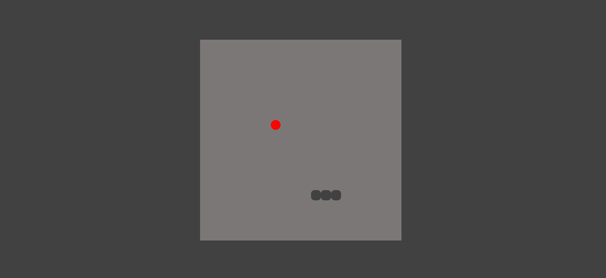

# Snake Game
# Demo
- [Click here](https://rupam-mondal.github.io/Snake-Game-JS/)

Welcome to the Snake Game! This classic arcade game will test your reflexes and strategic thinking as you navigate the snake through a grid, eating apples and growing longer with each bite.

## How to Play

1. Use the arrow keys to control the snake's movement: up, down, left, and right.
2. The snake will continuously move in the direction you choose until you change it or collide with a wall or your own body.
3. Your goal is to eat as many apples as possible without crashing into any obstacles.
4. Each time you eat an apple, the snake will grow longer, making it more challenging to navigate.
5. The game ends if the snake collides with a wall or itself.

## Features

- Simple and intuitive controls
- Increasing difficulty as the snake grows longer
- Score tracking to keep track of your progress
- High score leaderboard to compete with friends

## Installation

1. Clone the repository to your local machine.
2. Open the `index.html` file in your preferred web browser.
3. Start playing the Snake Game!

## Technologies Used

- HTML
- CSS
- JavaScript

## Contributing

Contributions are welcome! If you have any suggestions or improvements, please feel free to submit a pull request.

